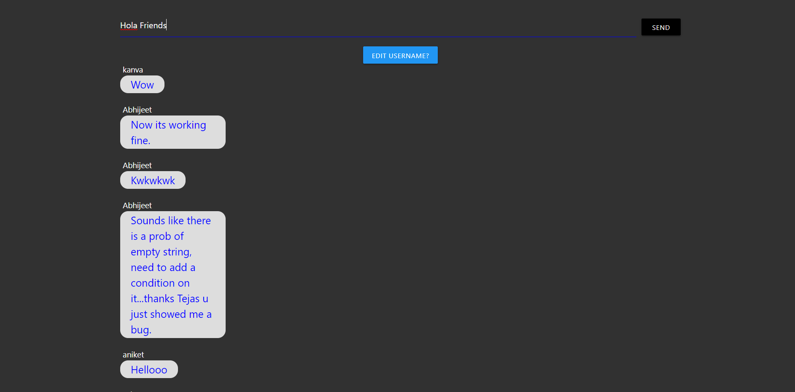

# Chat application
 Group chat app created using React and Firebase.

<!-- Applink :[uigenkit](https://uigenkit.herokuapp.com) -->

## Landing Page

###### Features
1. No need to login your user data will be stored in localhost.
2. Feel free to chat as it is a real time chat app, you will experience smooth chatting.

## Tech Stack
- Javascript, React.
- HTML5, CSS3, Materialize CSS.
- Firebase 